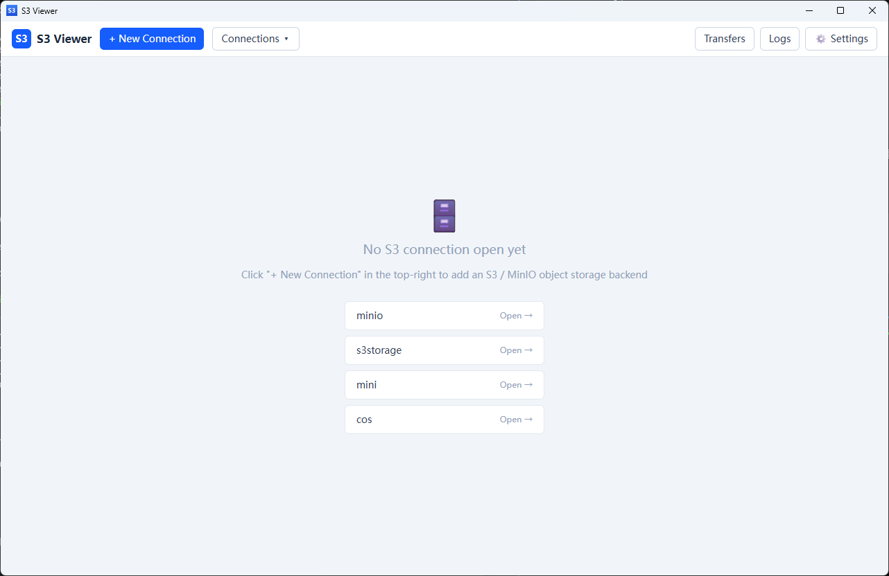
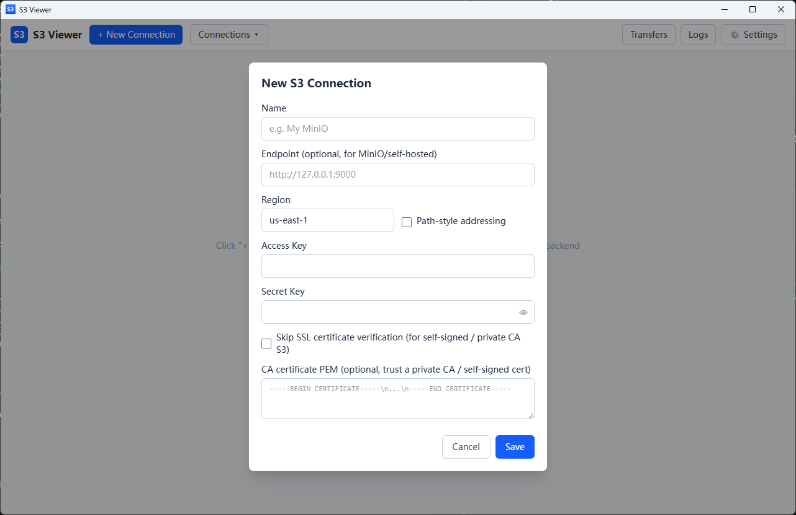
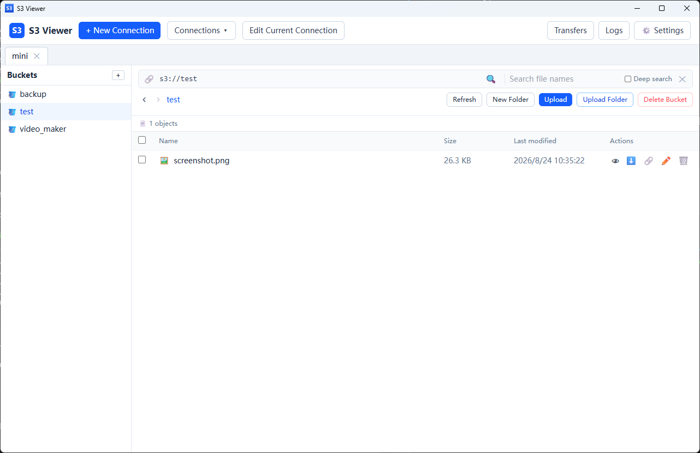

# S3 Viewer

[中文说明](README.zh-CN.md)

A cross-platform desktop application for browsing and managing S3-compatible object storage, built with [Tauri 2](https://tauri.app/) + [Vue 3](https://vuejs.org/) + [TypeScript](https://www.typescriptlang.org/).

Works with AWS S3, MinIO, Tencent COS, Alibaba OSS (S3-compatible mode), Cloudflare R2, and any other S3-compatible backend.



## Features

- **Multi-connection management** — add / edit / delete any number of S3-compatible connections with custom endpoint, region, path-style addressing and TLS options
- **Multi-tab browsing** — open multiple connections at once, each in its own tab
- **Bucket management** — list, create and delete buckets
- **File-manager style browsing** — folder tree sidebar, breadcrumb navigation, back / forward history (mouse side buttons supported), `s3://` address bar
- **Search** — filename search within the current folder by default; tick **Deep search** to search recursively through all subfolders
- **Upload** — multi-file upload, **whole-folder upload** (recursive), or simply drag & drop files and folders into the window; per-task progress tracking
- **Download** — single files, whole folders (recursive), or multi-select batch download
- **Preview** — images, text and PDF (powered by pdf.js) with configurable size limits
- **Share** — generate presigned URLs (GET / PUT) with expiry from 5 minutes to 7 days
- **Object operations** — rename, delete (recursive for folders), create folder
- **Transfers panel** — live progress for all running uploads / downloads
- **Operation logs** — searchable log of every action, with optional count badge
- **Import / export configurations** — share connection setups as JSON (file or clipboard)
- **Security** — credentials encrypted with Windows DPAPI on Windows; optional self-signed CA trust or TLS verification skip for private deployments
- **i18n & theming** — English / 简体中文, light / dark theme

## Screenshots

Connection form — supports custom endpoints (MinIO / self-hosted), path-style addressing, TLS options:



Bucket browsing with search, upload / download and object actions:



## Tech Stack

| Layer | Technology |
| --- | --- |
| Desktop shell | Tauri 2 (Rust) |
| Frontend | Vue 3 + Vite + Tailwind CSS 4 + TypeScript |
| S3 client | AWS SDK for Rust (`aws-sdk-s3`) |
| TLS | rustls (custom CA / skip-verify support) |
| PDF rendering | pdfjs-dist |

## Project Structure

```
.
├── src/                  # Vue 3 frontend
│   ├── components/       # UI components (browser, modals, panels)
│   ├── api.ts            # Typed wrappers around Tauri commands
│   ├── i18n.ts           # EN / 中文 translations
│   ├── settings.ts       # App settings (persisted in localStorage)
│   └── transfers.ts      # Transfer task state
├── src-tauri/            # Tauri 2 backend (Rust)
│   ├── src/s3.rs         # S3 operations (AWS SDK)
│   ├── src/lib.rs        # Tauri command handlers
│   └── src/config.rs     # Connection profile storage (DPAPI-encrypted on Windows)
└── screenshots/          # App screenshots
```

## Requirements

- [Node.js](https://nodejs.org/) 20+ with [pnpm](https://pnpm.io/)
- [Rust](https://www.rust-lang.org/) stable toolchain
- Tauri platform prerequisites (see [Tauri docs](https://v2.tauri.app/start/prerequisites/))

## Getting Started

```bash
pnpm install
pnpm tauri dev      # run the desktop app in dev mode
pnpm dev            # run only the Vite frontend (no Tauri window)
pnpm build          # build the frontend to dist/
pnpm typecheck      # type-check with vue-tsc
```

## Building a Release

```bash
pnpm tauri build
```

The installer is generated under `src-tauri/target/release/bundle/`.

## Plugins

First-party preview plugins live in the `plugins/` directory. Each plugin is a folder containing a `manifest.json` and a bundled `entry.js`.

- **Build** — `node plugins/build.mjs` bundles each plugin and packs `plugins/dist/plugin-<id>-<version>.zip`
- **Versioning** — plugin versions follow the app version. On every release, bump all plugin `manifest.json` versions to the current app version; a plugin that changes in a release carries the app's version, so users see an "Update" prompt
- **Publish** — upload the generated `plugins/dist/plugin-*.zip` to the GitHub Release; the "Available plugins" section on the plugin page then lists them for install / update

## Usage

### 1. Create a connection

Click **+ New Connection** and fill in:

- **Name** — a label shown in the connection list
- **Endpoint** — optional; leave empty for AWS S3, or set e.g. `http://127.0.0.1:9000` for MinIO
- **Region** — e.g. `us-east-1`
- **Path-style addressing** — enable for MinIO and most self-hosted backends
- **Access Key / Secret Key**
- **TLS options** — skip certificate verification, or paste a CA certificate PEM to trust a private CA / self-signed cert

### 2. Browse

Pick a bucket in the left sidebar. Navigate with breadcrumbs, the `s3://` address bar, or back / forward buttons (mouse side buttons work too).

### 3. Search

Click the 🔍 icon in the address bar. By default the search only covers the **current folder level**. Tick **Deep search** to search through all subfolders recursively.

### 4. Upload / download

- **Upload**: click **Upload** for files, **Upload Folder** for a whole folder, or drag & drop files / folders onto the list
- **Download**: use the ⬇️ icon per row, or tick multiple rows and use **Download Selected**
- Progress for every task is visible in the **Transfers** panel

### 5. Share

Use the 🔗 icon on a file to generate a presigned URL (GET or PUT) with a selectable expiry.

## Configuration Storage & Security

- Connection profiles are stored in `profiles.enc` inside the OS app-config directory
  (Windows: `%APPDATA%\<app>\profiles.enc`)
- **Access Key / Secret Key are stored in the OS credential vault** via the `keyring` crate (service `com.s3viewer.desktop`) — not written to the config file, except as a fallback when the system keyring is unavailable

  | Platform | Credential vault |
  | --- | --- |
  | Windows | Windows Credential Manager (DPAPI-backed) |
  | macOS | Keychain |
  | Linux | Secret Service (gnome-keyring / KWallet) |

- On **Windows**, the `profiles.enc` file itself is additionally encrypted with the current user's DPAPI — other user accounts cannot decrypt it
- On **non-Windows** platforms the file holds only non-secret profile metadata (endpoint / region / options) as JSON
- **Exported configuration files contain Access Key / Secret Key in plain text.** Keep them safe.

## FAQ

**Connection fails with a certificate error (self-signed / private CA)?**
Either tick *Skip SSL certificate verification* or paste your CA certificate PEM in the connection form.

**MinIO / self-hosted backend returns bucket errors?**
Enable *Path-style addressing* and double-check the endpoint URL (including `http://` / `https://`).

**Drag & drop doesn't work?**
Drop onto the object list area of an open bucket tab; the drop overlay highlights when the target is valid.

## License

See the `LICENSE` file in the repository (if present).
